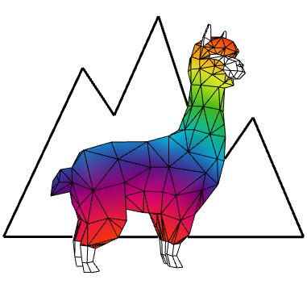

# openSeesGh
## To Do List

### Domenico Gaudioso

* [x] Create Disassemble Model - No more Lines, Mesh, Brick but only **GeometricModel** as output
* [x] Update Deformed Dynamic Model
* [x] Diagram Cds
* [x] Add 3df Solver
* [x] time-history: Displacement Vector every TimeStep for each node. Example: {0}(200)   {timeStep}(numbers of nodE)
* [x] Circular CrossSection has some visualisation problem / it update with Internal Thickness and not Diameter
* [x] modal analyses doesn't start from mode 1
* [x] add "IPE" section

* [ ] check input english name for IPE. web = anima, flange = flangia. Karamba could be a quick reference to look at.
* [ ] add inetia zz in ipe section
* [ ] add box section

* [x] circular Cross-Section less dense for visualisation
* [x] add view distribuited load in model view
* [x] add view concentrated mass load in model view ( create a sphere in node )
* [ ] add coding (in panel or path script ) and view post processing. Let's make a new component for import and visualize a text file
* [ ] modify loft mesh for brick ( problem con tetra )
* [ ] make it work DomeFunction
* [ ] Add Warning to the components. Ask Marco for some reference script
* [ ] Create Cluster when necessary

### Marco Pellegrino

* [x] Update Modal Analyses
* [x] Update Circular Cross-Section for Hollow Cross Section
* [x] creationFolder name is wrong. 
* [x] Automatically delete existing Folder to avoid to read previous file when the analyses fail

* [ ] EarthQuake Analyses - update for different way to make analyses
* [ ] update "ShellMITC" element type instead of "ShellNTGQ"
* [ ] Add Warning to the components
* [ ] look to eleForce in shell ( component name is 'shellForceView'... I thinks )

* [ ] Color Palette for components
* [ ] Documentation
* [ ] Icons

* [ ] Non Linear Material for Brick
