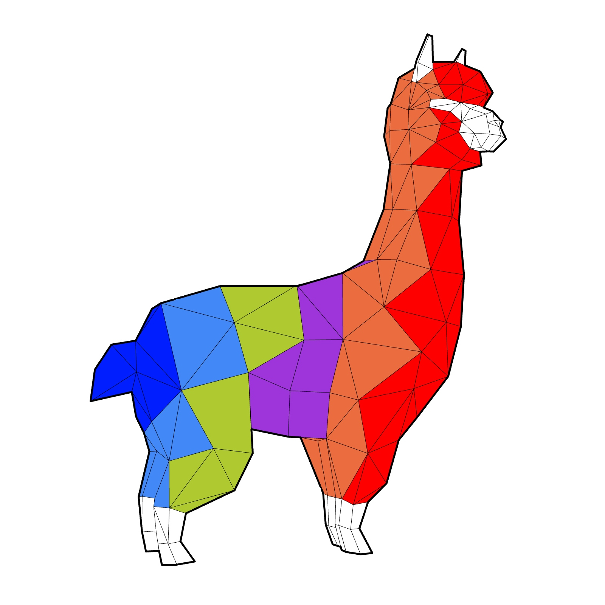

# Alpaca4d

__Alpaca4d__ is a Grasshopper plugin which has been developed on top of __*OpenSees*__. It lets you analyse beam, shell and brick elements through Static, Modal and Ground Motion Analysis.

   

__Alpaca4d__ facilitates the interaction with OpenSees making it possible to model complex geometries within your parametric workflow and reducing the time spent in the modelling. The main idea of Alpaca4d is to provide an efficient and easy way to use OpenSees without writing any line of code. The library is mostly used by researchers and academia because of the not user-friendly interface even if the math at the core library is highly sophisticated.

The belief is to bring more users to perform structural analyses with Opensees in a parametric environment such as Grasshopper.

The tool is still in the early stage and it will be improved in the future.

__Instagram__: [Alpaca4d](https://www.instagram.com/alpaca4d/)  
__Facebook__: [Alpaca4d](https://www.facebook.com/Alpaca4d)  
__e-mail__: alpaca4d@gmail.com  

Alpaca4d use the <strong>MPCO recorder</strong> - written by M.Petracca, G.Camata from 
<a href="https://asdeasoft.net/?home">ASDEA Software Technology</a>, Pescara Italy.

#### Disclaimer
The authors cannot be held responsible for the output and it should therefore always be used in combination with another finite element analysis package for validation and documentation.
